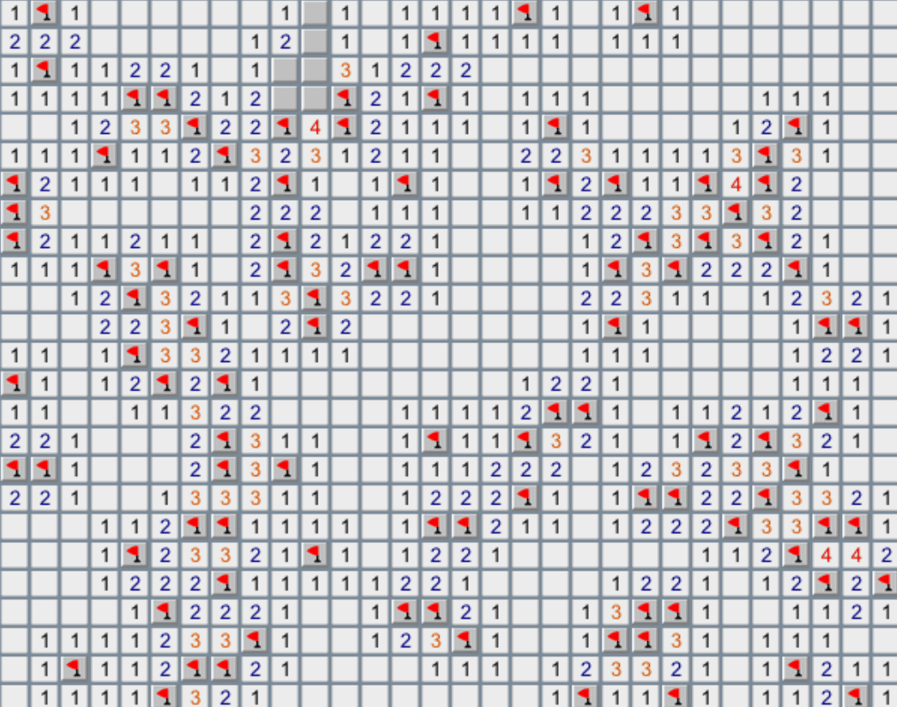
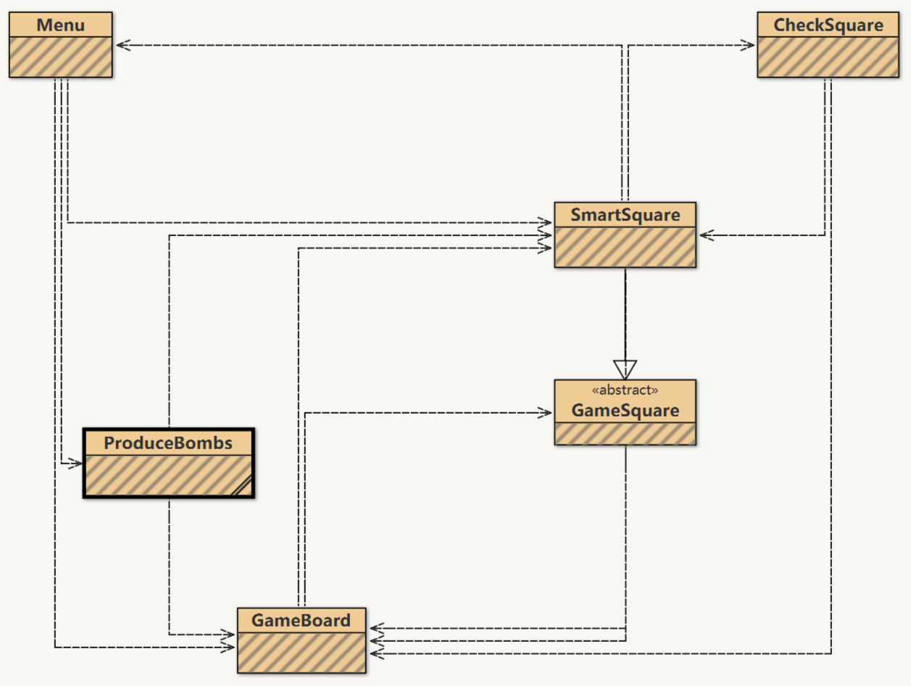

Table of Contents
=================

   * [Minesweeper Demo](#minesweeper-demo)
   * [Minesweeper](#minesweeper)
   * [Game Driver](#game-driver)
   * [Library](#library)
   * [User Interface](#user-interface)
      * [Menu](#menu)
      * [Board](#board)
      * [Squares](#squares)
      * [Bombs](#bombs)
   * [Download](#download)
   
# Minesweeper Demo

<p align="center"></p>

# Minesweeper
[](https://github.com/Hephaest/Minesweeper/blob/master/LICENSE)
[](https://www.oracle.com/technetwork/java/javase/8u202-relnotes-5209339.html)
[](https://github.com/Hephaest/Minesweeper/raw/master/download/Minesweeper_64-bit_Windows_Setup.exe)
[](https://github.com/Hephaest/Minesweeper/tree/master/src)

English | [中文](README_CN.md)

Last updated on `2019/07/06`

The minesweeper has following **functionalities**：
1. Displays an image of a bomb if that square has a bomb on it. 
2. Displays the number of bombs in surrounding squares if the player clicks the left mouse otherwise.
3. Works for a board of any size or shape (customisation)
4. Provides several levels of the game.
5. Display a red flag if the player single clicks the right mouse.
6. Display a question mark if the player double clicks the right mouse.
7. Display all bombs and squares with wrong operations if the player fails the game.
8. Display all bombs of squares replacing red flags if the player wins the game.

The source code contains an abstract class and an interface. I have divided my program into 3 parts: `GameDriver`, `Library`, `UserInterface`.

# Game Driver
This part is very simple. The `Driver` class is used to start the game.

The code is shown as follows:
```Java
package GameDriver;

import UserInterface.Menu;
/**
 * @author Hephaest
 * @since 3/21/2019 8:41 PM
 * This class is used to run the minesweeper program.
 */
public class Driver
{
	public static void main(String[] Args)
	{
		// Start the game with a menu.
		new Menu("Minesweeper");
	}
}
```
# Library
The package `Library` only contains 2 tools. The first one is abstract class `Bomb`, which stores the information about the game board.

The code is shown as follows:
```Java
package Library;

import UserInterface.GameBoard;
/**
 * @author Hephaest
 * @since 3/21/2019 8:41 PM
 * This class is abstract and should be extended to provide the domain specific functionality.
 */
public abstract class Bomb
{
    /** The GameBoard instance **/
    protected GameBoard board;

    /** The height of this GameBoard instance **/
    protected int boardHeight;

    /** The width of this GameBoard instance **/
    protected int boardWidth;

    /**
     * Create bombs, which can be placed on a GameBoard.
     * @param board the GameBoard upon which user clicks on.
     */
    public Bomb(GameBoard board)
    {
        this.board = board;
        // Both height and width of the board should remove its padding values.
        boardHeight = (board.getHeight() - 20) / 20;
        boardWidth = (board.getWidth() - 20) / 20;
    }

    /**
     * A method that is invoked when producing bombs on the game board.
     */
    protected abstract void reproduceBomb();

}
```
The second one is `TimeChecker`, an interface to convert milliseconds to a string representation of the corresponding time, is used in `SmartSquare` class.

The code is shown as follows:
```Java
package Library;
/**
 * @author Hephaest
 * @since 3/21/2019 8:41 PM
 * This interface has a static method to convert milliseconds to a string representation of the
 * corresponding time.
 */
public interface TimeChecker
{
    /**
     * This static method could return a string representation of the cost time by the given running time.
     * @param time the running time between the game starts and ends.
     * @return a string representation of the cost time.
     */
    static String calculateTime(long time)
    {
        int CONVERT_TO_SEC = 1000;
        int CONVERT_TO_OTHERS = 60;

        int ms = (int) time;
        int sec = ms / CONVERT_TO_SEC;
        int min = sec / CONVERT_TO_OTHERS; // Seconds convert to minutes.
        int hr = min / CONVERT_TO_OTHERS; // Minutes convert to hours.

        if (hr == 0)
        {
            if(min == 0)
            {
                if (sec == 0)
                    return ms + " ms";
                else
                    return sec + " sec " + ms % 1000 + " ms";
            } else
                return min + " min " + sec % CONVERT_TO_OTHERS + " sec " + ms % CONVERT_TO_SEC + " ms";
        } else
            return hr + " hour " + min % CONVERT_TO_OTHERS + " min " + sec % CONVERT_TO_OTHERS + " sec " + ms % CONVERT_TO_SEC + " ms";
    }
}
```
# User Interface
The following UML diagram could help you easier to understand relationships between the following classes:

<p align="center"></p>

## Menu
The `Menu` class provides 4 difficulty options to players: Beginner, Intermediate, Advanced and Custom. Especially for Custom, the program needs the check whether the player's input is valid or not. If the player confirms the option, the progarm starts the timer.

The code is shown as follows:
```Java
package UserInterface;

import javax.swing.*;
import java.awt.event.ActionEvent;
import java.awt.event.ActionListener;
import java.util.regex.Pattern;

/**
 * This class inherits from the JFrame class.
 * This class implements the methods from ActionListener to respond different click events.
 * This class provides 4 options for user to start a new game.
 * These 4 options are "Beginner", "Intermediate", "Advanced" and "Custom".
 * After clicking "New Game" button, this pop-window is automatically closing.
 * @author Hephaest
 * @since 3/21/2019 8:41 PM
 */
public class Menu extends JFrame implements ActionListener
{
    private JButton start;
    private JRadioButton beginner, intermediate, advanced, custom;
    private JTextField width, height, mines;

    /**
     * Create a menu of the given title.
     * @param title the title string for the window.
     */
    public Menu(String title)
    {
        // Create a window title.
        setTitle(title);

        // Create a subtitle
        JLabel subtitle = new JLabel("Difficulty");
        subtitle.setBounds(100,10,100,20);
        add(subtitle);

        // Create the "Beginner" radio button.
        beginner = new JRadioButton("Beginner");
        beginner.setBounds(40,40,150,20);
        add(beginner);

        // Create the "Beginner" descriptions.
        JLabel bDescFirstLine = new JLabel("10 mines");
        bDescFirstLine.setBounds(70,60,100,20);
        JLabel bDescSecondLine = new JLabel("10 x 10 tile grid");
        bDescSecondLine.setBounds(70,80,100,20);
        add(bDescFirstLine);
        add(bDescSecondLine);

        // Create the "Intermediate" radio button
        intermediate=new JRadioButton("Intermediate");
        intermediate.setBounds(40,100,150,20);
        add(intermediate);

        // Create the "Intermediate" descriptions.
        JLabel iDescFirstLine = new JLabel("40 mines");
        iDescFirstLine.setBounds(70,120,100,20);
        JLabel iDescSecondLine = new JLabel("16 x 16 tile grid");
        iDescSecondLine.setBounds(70,140,100,20);
        add(iDescFirstLine);
        add(iDescSecondLine);

        // Create the "Advanced" radio button
        advanced=new JRadioButton("Advanced");
        advanced.setBounds(40,160,160,20);
        add(advanced);

        // Create the "Advanced" descriptions.
        JLabel aDescFirstLine = new JLabel("100 mines");
        aDescFirstLine.setBounds(70,180,100,20);
        JLabel aDescSecondLine = new JLabel("30 x 25 tile grid");
        aDescSecondLine.setBounds(70,200,100,20);
        add(aDescFirstLine);
        add(aDescSecondLine);

        // Create the "Custom" radio button
        custom = new JRadioButton("Custom");
        custom.setBounds(40,220,100,20);
        add(custom);

        // Create the "Custom" labels and editable text fields.
        JLabel widthLabel = new JLabel("Width (10-30):");
        widthLabel.setBounds(70,240,80,20);
        add(widthLabel);

        width = new JTextField();
        width.setBounds(170,240,40,20);
        add(width);

        JLabel heightLabel = new JLabel("height (10-25):");
        heightLabel.setBounds(70,260,90,20);
        add(heightLabel);

        height = new JTextField();
        height.setBounds(170,260,40,20);
        add(height);

        JLabel mineLabel = new JLabel("Mines (10-100):");
        mineLabel.setBounds(70,280,90,20);
        add(mineLabel);

        mines = new JTextField();
        mines.setBounds(170,280,40,20);
        add(mines);

        // Create the "New Game" button.
        start = new JButton("New Game");
        start.setBounds(80,320,100,20);
        add(start);

        // Initialize the text fields' edit state.
        width.setEditable(false);
        height.setEditable(false);
        mines.setEditable(false);

        // Add actionListener to all buttons.
        custom.addActionListener(this);
        beginner.addActionListener(this);
        intermediate.addActionListener(this);
        advanced.addActionListener(this);
        start.addActionListener(this);

        // Ensure single choice.
        ButtonGroup group = new ButtonGroup();
        group.add(beginner);
        group.add(intermediate);
        group.add(advanced);
        group.add(custom);

        //Initialize this menu instance.
        beginner.setSelected(true);
        setSize(280,400);
        setLayout(null);
        setVisible(true);
        setResizable(false);
        setDefaultCloseOperation(EXIT_ON_CLOSE);
    }

    /**
     * An implementation method of ActionListener interface.
     * @param e the click event.
     */
    public void actionPerformed(ActionEvent e)
    {
        // If user chooses "Custom", set the text fields as editable.
        if (e.getSource() == custom)
        {
            width.setEditable(true);
            height.setEditable(true);
            mines.setEditable(true);
        } else if (e.getSource() == start) {
            // If user clicks "New Game" button, get the responding bomb amount, width and height of the board.
            int boardWidth = 0;
            int boardHeight = 0;
            int bombs = 0;
            boolean errorFlag = false;

            if (beginner.isSelected())
            {
                boardWidth = 10;
                boardHeight = 10;
                bombs = 10;
            } else if (intermediate.isSelected()) {
                boardWidth = 16;
                boardHeight = 16;
                bombs = 40;
            } else if (advanced.isSelected()) {
                boardWidth = 30;
                boardHeight = 25;
                bombs = 100;
            } else {
                if(!checkValid(width.getText(), height.getText(), mines.getText()))
                {
                    // mark a flag and display a window with error message.
                    errorFlag = true;
                    JOptionPane.showMessageDialog(null, "Please enter correct numbers!");

                } else {
                    boardWidth = Integer.parseInt(width.getText());
                    boardHeight = Integer.parseInt(height.getText());
                    bombs = Integer.parseInt(mines.getText());
                }
            }

            if(!errorFlag)
            {

                // Close current window and then display the board that meets the requirements.
                this.dispose();
                GameBoard b = new GameBoard("Minesweeper", boardWidth, boardHeight);
                new ProduceBombs(b, bombs);
                ((SmartSquare) b.getSquareAt(0, 0)).setStartTime(System.currentTimeMillis());
            }

        } else{
            // If user neither chooses "Custom" nor clicks "New Game" button, these fields cannot be editable.
            width.setEditable(false);
            height.setEditable(false);
            mines.setEditable(false);
        }
    }

    /**
     * Check whether user's inputs from the text fields are all vaild.
     * @param bWidth the width of the board.
     * @param bHeight the height of the board.
     * @param bomb the amount of bombs.
     * @return a boolean value of the check result.
     */
    private boolean checkValid(String bWidth, String bHeight, String bomb)
    {
        Pattern pattern = Pattern.compile("[0-9]*");
        if (bWidth == null || bHeight== null || bomb == null)
            return false;
        else if (bWidth.isEmpty() || bHeight.isEmpty() || bomb.isEmpty())
            return false;
        else if (!pattern.matcher(bWidth).matches() || !pattern.matcher(bHeight).matches() || !pattern.matcher(bomb).matches())
            return false;
        else if (Integer.parseInt(bWidth) < 10 || Integer.parseInt(bWidth) > 30 || Integer.parseInt(bHeight) < 10 || Integer.parseInt(bHeight) > 25
                || Integer.parseInt(bomb) < 10 || Integer.parseInt(bomb) > 100)
            return false;
        else
            return Integer.parseInt(bWidth) * Integer.parseInt(bHeight) >= Integer.parseInt(bomb);
    }
}
```
## Board
The `GameBoard` class could create a game window but this window should not be resizeable otherwise its height and width may not satisify game requirements. In addition, the game board should contain multiple squares and each square should own its action listener.

The code is shown as follows:
```Java
package UserInterface;

import javax.swing.*;
import java.awt.*;
import java.awt.event.*;
/**
 * This class provides a graphical model of a board game.
 * The class creates a rectangular panel of clickable squares,
 * of type SmartSquare. If a square is clicked by the user, a
 * callback method is invoked upon the corresponding SmartSquare instance.
 * The class is intended to be used as a basis for tile based games.
 * @author joe finney
 */
public class GameBoard extends JFrame implements ActionListener
{
	private JPanel boardPanel = new JPanel();

	private int boardHeight;
	private int boardWidth;
	private GameSquare[][] board;

	/**
	 * Create a new game board of the given size.
	 * As soon as an instance of this class is created, it is visualized
	 * on the screen.
	 *
	 * @param title the name printed in the window bar.
	 * @param width the width of the game area, in squares.
	 * @param height the height of the game area, in squares.
	 */
	public GameBoard(String title, int width, int height)
	{
		super();

		this.boardWidth = width;
		this.boardHeight = height;

		// Create game state.
		this.board = new GameSquare[width][height];

		// Set up window.
		setTitle(title);
		setSize(20 + width * 20,20 + height * 20);
		setContentPane(boardPanel);
		setResizable(false);
		setDefaultCloseOperation(JFrame.EXIT_ON_CLOSE);

		boardPanel.setLayout(new GridLayout(height,width));

		for (int y = 0; y < height; y++)
		{
			for (int x = 0; x < width; x++)
			{
				board[x][y] = new SmartSquare(x, y, this);
				board[x][y].addActionListener(this);

				boardPanel.add(board[x][y]);
			}
		}

		// make our window visible.
		setVisible(true);

	}

	/**
	 * Returns the GameSquare instance at a given location.
	 * @param x the x co-ordinate of the square requested.
	 * @param y the y co-ordinate of the square requested.
	 * @return the GameSquare instance at a given location
	 * if the x and y co-ordinates are valid - null otherwise.
	 */
	public GameSquare getSquareAt(int x, int y)
	{
		if (x < 0 || x >= boardWidth || y < 0 || y >= boardHeight)
			return null;

		return board[x][y];
	}

	public void actionPerformed(ActionEvent e)
	{
		// The button that has been pressed.
		GameSquare b = (GameSquare)e.getSource();
		b.clicked();
	}
}
```
## Squares
The abstract class `GameSquare` only provides fundamental methods. 

The code is shown as follows:
```Java
package UserInterface;

import javax.swing.*;
import java.net.URL;

/**
 * This class provides a representation of a single game square.
 * The class is abstract, and should be extended to provide domain.
 * specific functionality.
 * @author joe finney
 */
public abstract class GameSquare extends JButton
{
	/** The x co-ordinate of this square. **/
	protected int xLocation;

	/** The y co-ordinate of this square. **/
	protected int yLocation;

	/** The GameBoard upon which this GameSquare resides. **/
	protected GameBoard board;

	/**
	 * Create a new GameSquare, which can be placed on a GameBoard.
	 * @param x the x co-ordinate of this square on the game board.
	 * @param y the y co-ordinate of this square on the game board.
	 * @param filename file name.
	 * @param board the GameBoard upon which this square resides.
	 */
	public GameSquare(int x, int y, URL filename, GameBoard board)
	{
		super(new ImageIcon(filename));

		this.board = board;
		xLocation = x;
		yLocation = y;
	}

	/**
	 * Change the image displayed by this square to the given bitmap.
	 *
	 * @param filename the filename of the image to display.
	 */
	public void setImage(URL filename)
	{
		this.setIcon(new ImageIcon(filename));
	}

	/**
	 * A method that is invoked when a user clicks on this square.
	 *
	 */
	public abstract void clicked();
}
```
However, the class `SmartSquare` extends class `GameSquare` and overrides the clicked() method. As I have mention before, the click() method should achieve the following functionalities:
- Displays the number of bombs in surrounding squares if the player clicks the left mouse.
- Display a red flag if the player single clicks the right mouse.
- Display a question mark if the player double clicks the right mouse.

Besides, this object of this class has 2 special attributions: `guessThisSquareIsBomb`, `thisSquareHasTraversed`. Those attributions belong to **boolean** type. `guessThisSquareIsBomb` of an object becomes true when the player clicks this object once on the right mouse. As for `thisSquareHasTraversed`, this attribution is used to avoid infinite recursion, once player clicks an object, the program let `thisSquareHasTraversed` of this object becomes **true** .

The code is shown as follows:
```Java
package UserInterface;

import Library.TimeChecker;

import javax.swing.*;
import java.awt.event.MouseEvent;
import java.awt.event.MouseListener;

/**
 * This class inherits from the GameSquare class.
 * This class implements the methods from ActionListener and MouseListener to respond different click events.
 * Each square has its own unique representation of coordinates and attributes.
 * This class counts the number of its surrounding bombs once user clicks the square.
 * This class shows a pop-up window when the game failed or user succeed.
 * @author Hephaest
 * @since 3/21/2019 8:41 PM
 */
public class SmartSquare extends GameSquare implements MouseListener, TimeChecker
{
	/** The bomb existence of this square. **/
	private boolean thisSquareHasBomb;

	/** User sets a red flag on this square. **/
	private boolean guessThisSquareIsBomb;

	/** The traversal state of this square. **/
	private boolean thisSquareHasTraversed;

	/** The x co-ordinate of this square. **/
	private int xLocation;

	/** The y co-ordinate of this square. **/
	private int yLocation;

	/** The start time of the game. **/
	private long startTime;

	/**
	 * Create a new SmartSquare instance, which can be placed on a GameBoard.
	 * @param x the x co-ordinate of this square on the game board.
	 * @param y the y co-ordinate of this square on the game board.
	 * @param board the GameBoard upon which this square resides.
	 */
	public SmartSquare(int x, int y, GameBoard board)
	{
		// Paint this square as gray block when initialization.
		super(x, y, SmartSquare.class.getResource("/block.png"), board);

		// Assign coordinates to this square.
		xLocation = x;
		yLocation = y;

		// Initialize attributes.
		thisSquareHasBomb = false;
		thisSquareHasTraversed = false;
		guessThisSquareIsBomb = false;
		startTime = 0;

		// add right mouse listener.
		addMouseListener(this);
	}

	/**
	 * Set bomb existence of the SmartSquare instance as a given result.
	 * @param result the bomb existence of this SmartSquare instance.
	 */
	protected void setBombExist(boolean result)
	{
		thisSquareHasBomb = result;
	}

	/**
	 * Return bomb existence of the SmartSquare instance.
	 * @return the bomb existence of this SmartSquare instance.
	 */
	protected boolean getBombExist()
	{
		return thisSquareHasBomb;
	}

	/**
	 * Return traversal state of the SmartSquare instance.
	 * @return the traversal state of this SmartSquare instance.
	 */
	protected boolean getTraverse()
	{
		return thisSquareHasTraversed;
	}

	/**
	 * Set traversal state of the SmartSquare instance as a given result.
	 * @param result the traversal state of this SmartSquare instance.
	 */
	protected void setTraverse(boolean result)
	{
		thisSquareHasTraversed = result;
	}

	/**
	 * Return a boolean value whether user sets a red flag in this square or not.
	 * @return the state whether this square has been marked as a bomb or not.
	 */
	protected boolean getGuessThisSquareIsBomb()
	{
		return guessThisSquareIsBomb;
	}

	/**
	 * Set the start time of the game.
	 * @param time the time presented as milliseconds.
	 */
	protected void setStartTime(long time)
	{
		startTime = time;
	}

	/**
	 * Return the game start time.
	 * @return the time presented as milliseconds.
	 */
	protected long getStartTime()
	{
		return startTime;
	}

	/**
	 * An implementation method of abstract method (from GameSquare).
	 * Once get click event, detect bombs and expand into empty space.
	 */
	public void clicked()
	{

		CheckSquare cq = new CheckSquare(board);

		guessThisSquareIsBomb = false;

		if(thisSquareHasBomb)
		{
			/*
			 * If this square contains a bomb, show the bomb image.
			 * Then display the selection window.
			 */
			setImage(SmartSquare.class.getResource("/bombReveal.png"));
			long costTime = System.currentTimeMillis() - ((SmartSquare) board.getSquareAt(0, 0)).getStartTime();
			cq.showBomb(xLocation, yLocation);
			window("You used " + TimeChecker.calculateTime(costTime) +". Do you want to try again?", "Game Over",
					new ImageIcon(SmartSquare.class.getResource("/failFace.png")));
		} else{
			thisSquareHasTraversed = false;
			/*
			 * If this square doesn't contain a bomb, calculate its surrounding bombs.
			 * If this square has zero bombs in its surrounding squares,
			 * expanding into empty space until the surrounding of the space has at least one bomb
			 * or the space touches the window's boundary.
 			 */
			cq.countBomb(xLocation, yLocation);

			if (cq.isSuccess()) {
				long costTime = System.currentTimeMillis() - ((SmartSquare) board.getSquareAt(0, 0)).getStartTime();
				cq.showBomb(xLocation, yLocation);
				window("You win this game in " + TimeChecker.calculateTime(costTime) +
                        "! Do you want to try again?","Congratulations",
						new ImageIcon(SmartSquare.class.getResource("/passFace.jpg")));
			}
		}
	}

	/**
	 * A method to achieve pop-up window.
	 * @param msg the message to display on the window.
	 * @param title the title string for the window.
	 * @param img the icon.
	 */
	public void window(String msg, String title, Icon img)
	{

		int choose = JOptionPane.showConfirmDialog(board, msg, title,
				JOptionPane.YES_NO_OPTION, JOptionPane.QUESTION_MESSAGE,img);

		if (choose == JOptionPane.YES_OPTION)
		{
			new Menu("Mine sweeper");
		}

		// Close this window after user making a choice
		board.dispose();
	}

	/**
	 * An implementation method to respond right-click events.
	 * @param e the event when user clicks on this square.
	 */
	@Override
	public void mouseClicked(MouseEvent e)
	{
		// If user right-click on this square.
		if (e.getButton() == MouseEvent.BUTTON3)
		{
			int clickCount = e.getClickCount();

			// Show red flag.
			if (clickCount == 1)
			{
				setImage(SmartSquare.class.getResource("/redFlag.png"));
				guessThisSquareIsBomb = true;
			}

			// Show question mark.
			if (clickCount == 2)
			{
				setImage(SmartSquare.class.getResource("/questionMark.png"));
				guessThisSquareIsBomb = false;
			}
		}
	}

	// The following mouse events are not going to be handled in this class.
	@Override
	public void mousePressed(MouseEvent e) {}

	@Override
	public void mouseReleased(MouseEvent e) {}

	@Override
	public void mouseEntered(MouseEvent e) {}

	@Override
	public void mouseExited(MouseEvent e) {}
}
```
The most important class is `CheckSquare`, which checks the rest of untraversed squares and displays the number of bombs in surrounding the selected one. If the number is 0, the program will check the number of bombs surrounded in the surroundings. The terminated condition is that the target has been traversed or the position of target is out of the boundary. Note that surrounding squares a classified as the eight squares that are horizontally, vertically or diagonally adjacent to the square. 

The success condition is `the total number of squares = the total number of bombs (getTraverse() = true) + the number of squares the user clicked (getTraverse() = true)`. Therefore, this condition can be simplified as the program only needs to traverse all the squares. If each square is traversed, it means that the player wins the game.

The code is shown as follows:
```Java
package UserInterface;
/**
 * @author Hephaest
 * @since 3/21/2019 8:41 PM
 * This class provides a way to count the total number of bombs which surrounds the given square.
 */
public class CheckSquare
{
    /** The GameBoard instance **/
    private GameBoard board;

    /** The height of this GameBoard instance **/
    private int boardHeight;

    /** The width of this GameBoard instance **/
    private int boardWidth;

    private static final int[] distantX = {-1, 0, 1};
    private static final int[] distantY = {-1, 0, 1};

    /**
     * Create a CheckSquare instance contained with the given board.
     * @param board the GameBoard upon which user clicks on.
     */
    public CheckSquare(GameBoard board)
    {
        this.board = board;
        // Both height and width of the board should remove its padding values.
        boardHeight = (board.getHeight() - 20) / 20;
        boardWidth = (board.getWidth() - 20) / 20;
    }

    /**
     * Returns the check result of the given position.
     * @param x the x co-ordinate of the given square.
     * @param y the y co-ordinate of the given square.
     * @return a boolean value of the check result.
     */
    private boolean hasKickedBoundary(int x, int y)
    {
        return x < 0 || x >= boardWidth || y < 0 || y >= boardHeight;
    }

    /**
     * Returns the check result whether user has found out all bombs.
     * @return a boolean value of the check result.
     */
    protected boolean isSuccess()
    {
        // Ensure count start at 0 once this method is invoked.
        int count = 0;

        for (int y = 0; y < boardHeight; y++)
        {
            for (int x = 0; x < boardWidth; x++)
            {
                if (((SmartSquare) board.getSquareAt(x, y)).getTraverse())
                    count++;
            }
        }

        return count == boardHeight * boardWidth;
// Alternative method.
//        for (int y = 0; y < boardHeight; y++)
//        {
//            for (int x = 0; x < boardWidth; x++)
//            {
//                if (!((SmartSquare) board.getSquareAt(x, y)).getTraverse()) return false;
//            }
//        }
//        return true;	
    }

    /**
     * This method reveals all bombs on the board, examine the square where user guesses it has a bomb.
     * @param currentX the x co-ordinate of the given square.
     * @param currentY the y co-ordinate of the given square.
     */
    protected void showBomb(int currentX, int currentY)
    {
        for (int y = 0; y < boardHeight; y++)
        {
            for (int x = 0; x < boardWidth; x++)
            {
                if (currentX == x && currentY == y){}
                else if (((SmartSquare) board.getSquareAt(x, y)).getBombExist())
                    board.getSquareAt(x, y).setImage(CheckSquare.class.getResource("/bomb.png"));
                else if(((SmartSquare) board.getSquareAt(x, y)).getGuessThisSquareIsBomb())
                    board.getSquareAt(x, y).setImage(CheckSquare.class.getResource("/flagWrong.png")); // Wrong guess!
            }
        }
    }

    /**
     * This method counts the total number of bombs which surrounds the given square.
     * If there is no bombs surrounds the square, paint this square as blank then expand its surrounding squares.
     * until find bombs of the surrounding squares are not empty. This method is implemented by recursion algorithm.
     * @param currentX the x co-ordinate of the given square.
     * @param currentY the y co-ordinate of the given square.
     */
    protected void countBomb(int currentX, int currentY)
    {
        // Ensure count start at 0 once this method is invoked.
        int count = 0;
        SmartSquare currentObject;

        if (hasKickedBoundary(currentX, currentY))
            return; //Skip iteration.
        else if(((SmartSquare)board.getSquareAt(currentX, currentY)).getTraverse())
            return; //Skip iteration.
        else {
            // Declare a SmartSquare instance.
            SmartSquare squareObject;

            // Get the current square.
            currentObject = (SmartSquare)board.getSquareAt(currentX, currentY);
            currentObject.setTraverse(true);

            /*
             * Check surrounding 8 squares:
             * If the square has touch the boundary, skip to next iteration of the loop.
             * Else if the square is itself, then it's unnecessary to count. Just skip to next iteration of the loop.
             * Else check whether this surrounding square contains a bomb. If it does, count accumulation.
             */
            for (int x : distantX)
            {
                for (int y: distantY)
                {
                    if (hasKickedBoundary(currentX + x, currentY + y)){}
                    else if (x == 0 && y == 0){}
                    else{
                        squareObject = (SmartSquare)board.getSquareAt(currentX + x, currentY + y);
                        count = squareObject.getBombExist() ? count + 1 : count;
                    }
                }
            }
        }

        /*
         * If count result is zero, then replace this square with its surrounding
         * squares and invoke itself to find the bombs again.
         */
        if (count != 0)
            currentObject.setImage(CheckSquare.class.getResource( "/" + count + ".png"));
        else {
            // Paint current square as blank.
            currentObject.setImage(CheckSquare.class.getResource("/0.png"));
            countBomb(currentX - 1, currentY -1); // Upper left.
            countBomb(currentX, currentY -1); // Above.
            countBomb(currentX + 1, currentY -1); // Upper right.
            countBomb(currentX - 1, currentY); // Left side.
            countBomb(currentX + 1, currentY); // Right side.
            countBomb(currentX - 1, currentY + 1); // Lower left.
            countBomb(currentX, currentY + 1); // Below.
            countBomb(currentX + 1, currentY + 1); // Lower right.
        }
    }
}
```
## Bombs
Randomly generating the bombs always causes collisions. The class `ProduceBombs` is used to handle this issue, each square has an attribution called `thisSquareHasBomb` to record whether the current square already contains a bomb. If the answer is true, we need to re-allocate the bomb until it is no longer conflict with others. This method mainly uses **tail recursion**.

The code is shown as follows:
```Java
package UserInterface;

import Library.Bomb;
import java.util.Random;
/**
 * This class provides a method to generate bombs on the board.
 * This class mainly uses recursion algorithm to put bombs on different squares.
 * @version V1.0
 * @author Hephaest
 * @since 2019-03-12 20:18
 */
public class ProduceBombs extends Bomb
{
    /**
     * Create a ProduceBombs instance to generate bombs at the given board.
     * Using recursion algorithm to avoid generating more than one bomb on the same square.
     * @param board the GameBoard upon which user clicks on.
     * @param number the total number of bombs.
     */
    public ProduceBombs(GameBoard board, int number)
    {

        super(board);

        int count =0;

        do {
            reproduceBomb();
            count++;
        }while (count < number);
    }

    /**
     * This method produce bombs on random square. If the assigned square has already contained a bomb, then
     * reassign a square to receive this bomb by invoking itself.
     */
    public void reproduceBomb()
    {
        Random r = new Random();

        int xLocation = r.nextInt(boardWidth);
        int yLocation = r.nextInt(boardHeight);

        SmartSquare square = (SmartSquare) board.getSquareAt(xLocation, yLocation);

        if (!square.getBombExist())
        {
            // mark this square as it has a bomb and been traversed.
            square.setBombExist(true);
            square.setTraverse(true);
        } else {
            reproduceBomb();
        }
    }
}
```
# Download
I have packed the source code as executable files for multiple platforms. Enjoy yourself! 

**For Windows 64-bit**: [Download here](https://github.com/Hephaest/Minesweeper/raw/master/download/Minesweeper_64-bit_Windows_Setup.exe)

**For MacOS**: [Download here](https://github.com/Hephaest/Minesweeper/raw/master/download/Minesweeper_MacOS_Setup.dmg)

**For Unix/Linux**: [Download here](https://github.com/Hephaest/Minesweeper/raw/master/download/Mine_Unix_SetUp.sh)
