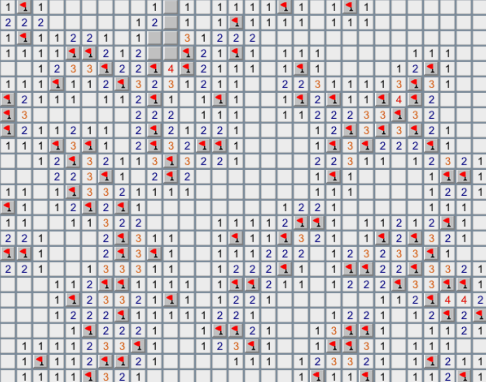
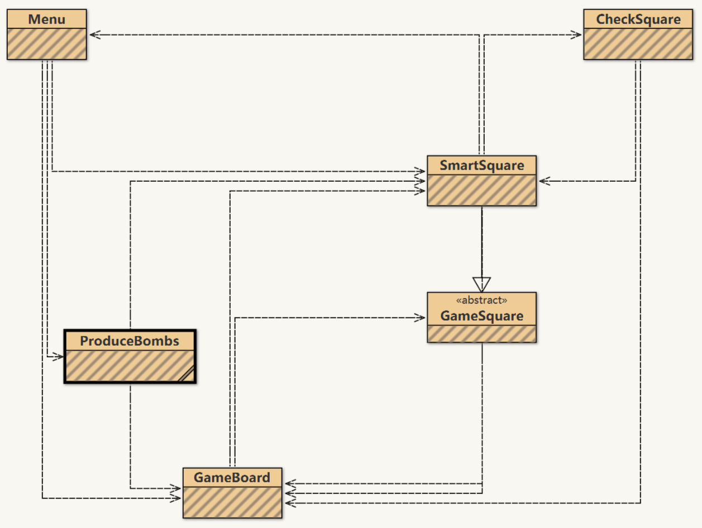

目录
=================

   * [效果演示图](#效果演示图)
   * [Java 实现经典扫雷游戏](#java-实现经典扫雷游戏)
   * [游戏驱动](#游戏驱动)
   * [工具库](#工具库)
   * [用户界面](#用户界面)
      * [菜单](#菜单)
      * [窗口](#窗口)
      * [方块](#方块)
      * [炸弹](#炸弹)
   * [下载](#下载)
   
# 效果演示图

<p align="center"></p>

# Java 实现经典扫雷游戏
[](https://github.com/Hephaest/Minesweeper/blob/master/LICENSE)
[](https://www.oracle.com/technetwork/java/javase/8u202-relnotes-5209339.html)
[](https://github.com/Hephaest/Minesweeper/raw/master/download/Minesweeper_64-bit_Windows_Setup.exe)

[English](README.md) | 中文

最后一次更新于 `2019/07/08`

本扫雷游戏有以下**功能**：
1. 如果点中炸弹会显示炸弹。
2. 玩家左键点击方块能显示该方块周围会出现几个炸弹，如果不存在炸弹的话扫描范围会被放大。
3. 满足各种行数，列数和炸弹个数要求。
4. 对不同水平的玩家提供不同的游戏难度级别。
5. 如果玩家单击鼠标右键会显示红旗。
6. 如果玩家双击鼠标右键会显示问号。
7. 如果玩家游戏挑战失败显示所有炸弹隐藏的地方以及玩家失误标记的地方。
8. 如果玩家挑战成功显示所有的炸弹(原本炸弹的位置有可能已被玩家用小红旗标识了)。

源代码包括抽象类和接口。我将程序分为三个部分来介绍：`GameDriver`，`Library`，`UserInterface`。

# 游戏驱动
这部分相当简单(因为只有一个主函数)。`Driver` 类被用于作为启动游戏的接口。

代码如下所示：
```Java
package GameDriver;

import UserInterface.Menu;
/**
 * @author Hephaest
 * @since 3/21/2019 8:41 PM
 * 此类是用来运行扫雷游戏程序的。
 */
public class Driver
{
	public static void main(String[] Args)
	{
		// 游戏启动的时候会附带一个选项菜单窗口。
		new Menu("Minesweeper");
	}
}
```
# 工具库
包 `Library` 内只有两个文件。第一个是抽象类 `Bomb`，它用于存储和有关游戏窗口的物理信息。

代码如下所示：
```Java
package Library;

import UserInterface.GameBoard;
/**
 * @author Hephaest
 * @since 3/21/2019 8:41 PM
 * 这个抽象类中的抽象方法会在被继承时实现。
 */
public abstract class Bomb
{
    /** 游戏窗口实例 **/
    protected GameBoard board;

    /** 实例的高度 **/
    protected int boardHeight;

    /** 实例的宽度 **/
    protected int boardWidth;

    /**
     * Create bombs, which can be placed on a GameBoard.
     * @param board the GameBoard upon which user clicks on.
     */
    public Bomb(GameBoard board)
    {
        this.board = board;
        // 真正加入计算的高和宽去需要减去填充边距的长度。
        boardHeight = (board.getHeight() - 20) / 20;
        boardWidth = (board.getWidth() - 20) / 20;
    }

    /**
     * 该方法将会被用于分布炸弹的位置。
     */
    protected abstract void reproduceBomb();

}
```
第二个工具就是 `TimeChecker` 接口，它使用将毫秒时间转换成相对应的时间表达，将会被用于 `SmartSquare` 类。

代码如下所示：
```Java
package Library;
/**
 * @author Hephaest
 * @since 3/21/2019 8:41 PM
 * 这个接口有个静态方法通过给定的毫秒时间换算成相对应的时间表达。
 */
public interface TimeChecker
{
    /**
     * 根据程序给定的运行时间返回程序运行时间的标准表达。
     * @param time 在游戏开始和结束之间的时间。
     * @return 总用时的文本描述。
     */
    static String calculateTime(long time)
    {
        int CONVERT_TO_SEC = 1000;
        int CONVERT_TO_OTHERS = 60;

        int ms = (int) time;
        int sec = ms / CONVERT_TO_SEC;
        int min = sec / CONVERT_TO_OTHERS; // 把秒转换成分。
        int hr = min / CONVERT_TO_OTHERS; // 把分转化成小时。

        if (hr == 0)
        {
            if(min == 0)
            {
                if (sec == 0)
                    return ms + " ms";
                else
                    return sec + " sec " + ms % 1000 + " ms";
            } else
                return min + " min " + sec % CONVERT_TO_OTHERS + " sec " + ms % CONVERT_TO_SEC + " ms";
        } else
            return hr + " hour " + min % CONVERT_TO_OTHERS + " min " + sec % CONVERT_TO_OTHERS + " sec " + ms % CONVERT_TO_SEC + " ms";
    }
}
```
# 用户界面
下方的 UML 图 可以帮助您理解以下几个类之间的关系：

<p align="center"></p>

## 菜单
`Menu` 类为玩家提供了4种难度级别的选项：初级，中级，高级和自定义。尤其对于自定义来说，程序需要检验玩家的输入是否符合要求。如果玩家确定选择了以后，选择菜单消失，启动游戏窗口。

代码如下所示：
```Java
package UserInterface;

import javax.swing.*;
import java.awt.event.ActionEvent;
import java.awt.event.ActionListener;
import java.util.regex.Pattern;

/**
 * 该类继承 JFrame 类。
 * 该类实现了 ActionListener 里对不用点击事件的反馈。
 * 该类提供4个选项供玩家选择。
 * 这4个选项分别是 "初级"，"中级"，"高级" 和 "自定义"。
 * 在点击 "New Game" 按钮之后，菜单窗口自动关闭。
 * @author Hephaest
 * @since 3/21/2019 8:41 PM
 */
public class Menu extends JFrame implements ActionListener
{
    private JButton start;
    private JRadioButton beginner, intermediate, advanced, custom;
    private JTextField width, height, mines;

    /**
     * 创建一个给定标题的菜单。
     * @param title 菜单上的标题。
     */
    public Menu(String title)
    {
        // 设置菜单标题。
        setTitle(title);

        // 创建菜单子标题。
        JLabel subtitle = new JLabel("Difficulty");
        subtitle.setBounds(100,10,100,20);
        add(subtitle);

        // 创建 "初级" 选择按钮。
        beginner = new JRadioButton("Beginner");
        beginner.setBounds(40,40,150,20);
        add(beginner);

        // 设置 "初级" 选择的描述。
        JLabel bDescFirstLine = new JLabel("10 mines");
        bDescFirstLine.setBounds(70,60,100,20);
        JLabel bDescSecondLine = new JLabel("10 x 10 tile grid");
        bDescSecondLine.setBounds(70,80,100,20);
        add(bDescFirstLine);
        add(bDescSecondLine);

        // 创建 "中级" 选择按钮。
        intermediate=new JRadioButton("Intermediate");
        intermediate.setBounds(40,100,150,20);
        add(intermediate);

        // 设置 "中级" 选择的描述。
        JLabel iDescFirstLine = new JLabel("40 mines");
        iDescFirstLine.setBounds(70,120,100,20);
        JLabel iDescSecondLine = new JLabel("16 x 16 tile grid");
        iDescSecondLine.setBounds(70,140,100,20);
        add(iDescFirstLine);
        add(iDescSecondLine);

        // 创建 "高级" 选择按钮。
        advanced=new JRadioButton("Advanced");
        advanced.setBounds(40,160,160,20);
        add(advanced);

        // 设置 "高级" 选择的描述。
        JLabel aDescFirstLine = new JLabel("100 mines");
        aDescFirstLine.setBounds(70,180,100,20);
        JLabel aDescSecondLine = new JLabel("30 x 25 tile grid");
        aDescSecondLine.setBounds(70,200,100,20);
        add(aDescFirstLine);
        add(aDescSecondLine);

        // 创建 "自定义" 选择按钮。
        custom = new JRadioButton("Custom");
        custom.setBounds(40,220,100,20);
        add(custom);

        // 设置 "自定义" 选择的描述。
        JLabel widthLabel = new JLabel("Width (10-30):");
        widthLabel.setBounds(70,240,80,20);
        add(widthLabel);

        width = new JTextField();
        width.setBounds(170,240,40,20);
        add(width);

        JLabel heightLabel = new JLabel("height (10-25):");
        heightLabel.setBounds(70,260,90,20);
        add(heightLabel);

        height = new JTextField();
        height.setBounds(170,260,40,20);
        add(height);

        JLabel mineLabel = new JLabel("Mines (10-100):");
        mineLabel.setBounds(70,280,90,20);
        add(mineLabel);

        mines = new JTextField();
        mines.setBounds(170,280,40,20);
        add(mines);

        // 创建 "开始游戏" 选择按钮。
        start = new JButton("New Game");
        start.setBounds(80,320,100,20);
        add(start);

        // 初始化每个文本框的编辑状态。
        width.setEditable(false);
        height.setEditable(false);
        mines.setEditable(false);

        // 在每个按键上添加监听事件。
        custom.addActionListener(this);
        beginner.addActionListener(this);
        intermediate.addActionListener(this);
        advanced.addActionListener(this);
        start.addActionListener(this);

        // 确保单选。
        ButtonGroup group = new ButtonGroup();
        group.add(beginner);
        group.add(intermediate);
        group.add(advanced);
        group.add(custom);

        // 初始化菜单实例。
        beginner.setSelected(true);
        setSize(280,400);
        setLayout(null);
        setVisible(true);
        setResizable(false);
        setDefaultCloseOperation(EXIT_ON_CLOSE);
    }

    /**
     * 实现 ActionListener 接口。
     * @param e 点击事件。
     */
    public void actionPerformed(ActionEvent e)
    {
        // 如果用户选择 "自定义"，设置文本框为可编辑状态。
        if (e.getSource() == custom)
        {
            width.setEditable(true);
            height.setEditable(true);
            mines.setEditable(true);
        } else if (e.getSource() == start) {
            // 如果用户点击 "开始游戏" 按钮，获得相对应的炸弹总数，游戏窗口的长和宽。
            int boardWidth = 0;
            int boardHeight = 0;
            int bombs = 0;
            boolean errorFlag = false;

            if (beginner.isSelected())
            {
                boardWidth = 10;
                boardHeight = 10;
                bombs = 10;
            } else if (intermediate.isSelected()) {
                boardWidth = 16;
                boardHeight = 16;
                bombs = 40;
            } else if (advanced.isSelected()) {
                boardWidth = 30;
                boardHeight = 25;
                bombs = 100;
            } else {
                if(!checkValid(width.getText(), height.getText(), mines.getText()))
                {
                    // 设置标记并在窗口上弹出错误提示。
                    errorFlag = true;
                    JOptionPane.showMessageDialog(null, "Please enter correct numbers!");

                } else {
                    boardWidth = Integer.parseInt(width.getText());
                    boardHeight = Integer.parseInt(height.getText());
                    bombs = Integer.parseInt(mines.getText());
                }
            }

            if(!errorFlag)
            {

                // 关闭当前菜单窗口并弹出与之对应的游戏窗口。
                this.dispose();
                GameBoard b = new GameBoard("Minesweeper", boardWidth, boardHeight);
                new ProduceBombs(b, bombs);
                ((SmartSquare) b.getSquareAt(0, 0)).setStartTime(System.currentTimeMillis());
            }

        } else{
            // 如果玩家即没有选择 "Custom" 也没有点击 "New Game" 按钮，这些文本框要设置成不可编辑的状态。
            width.setEditable(false);
            height.setEditable(false);
            mines.setEditable(false);
        }
    }

    /**
     * 检查玩家的输入是否符合要求。
     * @param bWidth 游戏窗口的宽度。
     * @param bHeight 游戏窗口的高度。
     * @param bomb 炸弹的总数
     * @return 返回检查结果的布尔值。
     */
    private boolean checkValid(String bWidth, String bHeight, String bomb)
    {
        Pattern pattern = Pattern.compile("[0-9]*");
        if (bWidth == null || bHeight== null || bomb == null)
            return false;
        else if (bWidth.isEmpty() || bHeight.isEmpty() || bomb.isEmpty())
            return false;
        else if (!pattern.matcher(bWidth).matches() || !pattern.matcher(bHeight).matches() || !pattern.matcher(bomb).matches())
            return false;
        else if (Integer.parseInt(bWidth) < 10 || Integer.parseInt(bWidth) > 30 || Integer.parseInt(bHeight) < 10 || Integer.parseInt(bHeight) > 25
                || Integer.parseInt(bomb) < 10 || Integer.parseInt(bomb) > 100)
            return false;
        else
            return Integer.parseInt(bWidth) * Integer.parseInt(bHeight) >= Integer.parseInt(bomb);
    }
}
```
## 窗口
`GameBoard` 类可以创建一个新的窗口，但要求这个窗口不被缩放不然会影响到计算时需要用到的长和宽。除此之外，在游戏窗口里的每一个小方块应该有自己的事件监听器。

代码如下所示：
```Java
package UserInterface;

import javax.swing.*;
import java.awt.*;
import java.awt.event.*;
/**
 * 该类为游戏窗口提供图形模型。
 * 该类创建了可点击的矩形面板
 * 如果玩家点击了小方块，会在响应的 SmartSquare 实例种调用回调函数。
 * 该类是基于平铺的游戏的基础。
 * @author joe finney
 */
public class GameBoard extends JFrame implements ActionListener
{
	private JPanel boardPanel = new JPanel();

	private int boardHeight;
	private int boardWidth;
	private GameSquare[][] board;

	/**
	 * 创建给定大小的游戏窗口。
	 * 一旦该类实例被创建，窗口将可视化。
	 *
	 * @param title 窗口栏的标题。
	 * @param width 以方块作单位的窗口的宽。
	 * @param height 以方块作单位的窗口的高。
	 */
	public GameBoard(String title, int width, int height)
	{
		super();

		this.boardWidth = width;
		this.boardHeight = height;

		// 创建游戏初始方块。
		this.board = new GameSquare[width][height];

		// 新建窗口。
		setTitle(title);
		setSize(20 + width * 20,20 + height * 20);
		setContentPane(boardPanel);
		setResizable(false);
		setDefaultCloseOperation(JFrame.EXIT_ON_CLOSE);

		boardPanel.setLayout(new GridLayout(height,width));

		for (int y = 0; y < height; y++)
		{
			for (int x = 0; x < width; x++)
			{
				board[x][y] = new SmartSquare(x, y, this);
				board[x][y].addActionListener(this);

				boardPanel.add(board[x][y]);
			}
		}

		// 使窗口可视化。
		setVisible(true);

	}

	/**
	 * 返回给定位置的方块。
	 * @param x 给定方块的 x 的坐标。
	 * @param y 给定方块的 y 的坐标。
	 * @return 返回给定位置的方块。
	 * 如果 x 和 y 的位置都在边界范围内，则给出响应的方块对象，否则返回 null.
	 */
	public GameSquare getSquareAt(int x, int y)
	{
		if (x < 0 || x >= boardWidth || y < 0 || y >= boardHeight)
			return null;

		return board[x][y];
	}

	public void actionPerformed(ActionEvent e)
	{
		// 被点击的方块，需要处理点击情况。
		GameSquare b = (GameSquare)e.getSource();
		b.clicked();
	}
}
```
## 方块
抽象类 `GameSquare` 只提供基本的方法。

代码如下所示：
```Java
package UserInterface;

import javax.swing.*;
import java.net.URL;

/**
 * 该类描述了方块对象中主要的属性和方法。
 * 该类是抽象的，将在之后被继承，被继承的抽象方法需要被实现。
 * @author joe finney
 */
public abstract class GameSquare extends JButton
{
	/** 方块的 x 坐标 **/
	protected int xLocation;

	/** 方块的 y 坐标 **/
	protected int yLocation;

	/** 方块所在的游戏窗口 **/
	protected GameBoard board;

	/**
	 * 创建一个会被放在游戏窗口的方块对象。
	 * @param x 方块相对于游戏窗口的 x 坐标。
	 * @param y 方块相对于游戏窗口的 y 坐标。
	 * @param filename 图片文件所在位置。
	 * @param board 游戏窗口。
	 */
	public GameSquare(int x, int y, URL filename, GameBoard board)
	{
		super(new ImageIcon(filename));

		this.board = board;
		xLocation = x;
		yLocation = y;
	}

	/**
	 * 根据所给的文件地址更改当前方块渲染的图像。
	 *
	 * @param filename 需要更新的图片的地址，
	 */
	public void setImage(URL filename)
	{
		this.setIcon(new ImageIcon(filename));
	}

	/**
	 * 用户点击调用的方法。
	 */
	public abstract void clicked();
}
```
然而，`SmartSquare` 类继承了 `GameSquare` 类并重写了 `clicked()` 方法。 `click()` 方法需要实现以下**功能**:
- 玩家左键点击方块能显示该方块周围会出现几个炸弹。
- 如果玩家单击鼠标右键会显示红旗。
- 如果玩家双击鼠标右键会显示问号

除此之外，该对象的实例拥有两个特殊的属性: `guessThisSquareIsBomb` 和 `thisSquareHasTraversed`。这些属性都是**布尔**类型的。 `guessThisSquareIsBomb` 为真当玩家右键单击鼠标。 `thisSquareHasTraversed` 是用来防止无限递归的。一旦用户左键点击过方块该方块的 `thisSquareHasTraversed` 为**真**。

代码如下所示：
```Java
package UserInterface;

import Library.TimeChecker;

import javax.swing.*;
import java.awt.event.MouseEvent;
import java.awt.event.MouseListener;

/**
 * 该类继承 GameSquare 类。
 * 该类实现了 ActionListener 和 MouseListener 的方法，对不同的点击事件有不同的响应。
 * 每一个方块有自己独一无二的二维坐标和属性值。
 * 一旦玩家鼠标左击点击该类的实例，会马上显示出该方块周围存在几个炸弹。
 * 该类提供一个弹出窗口无论玩家挑战成功或失败。
 * @author Hephaest
 * @since 3/21/2019 8:41 PM
 */
public class SmartSquare extends GameSquare implements MouseListener, TimeChecker
{
	/** 炸弹在该方块的存在与否 **/
	private boolean thisSquareHasBomb;

	/** 玩家是否有在该方块上设置红旗 **/
	private boolean guessThisSquareIsBomb;

	/** 该方块是否被遍历过 **/
	private boolean thisSquareHasTraversed;

	/** 该方块的 x 坐标 **/
	private int xLocation;

	/** 该方块的 y 坐标 **/
	private int yLocation;

	/** 该方块记录的游戏开始时间 **/
	private long startTime;

	/**
	 * 创建该类的新实例并放到游戏窗口上去。
	 * @param x 该方块相对于游戏窗口的 x 的坐标。
	 * @param y 该方块相对于游戏窗口的 y 的坐标。
	 * @param board 该方块所在的游戏窗口。
	 */
	public SmartSquare(int x, int y, GameBoard board)
	{
		// 初始化时将方块变成灰色。
		super(x, y, SmartSquare.class.getResource("/block.png"), board);

		// 赋值地址。
		xLocation = x;
		yLocation = y;

		// 初始化属性。
		thisSquareHasBomb = false;
		thisSquareHasTraversed = false;
		guessThisSquareIsBomb = false;
		startTime = 0;

		// 添加右键监听器。
		addMouseListener(this);
	}

	/**
	 * 为炸弹是否存在于该方块设定值。
	 * @param result 给定的布尔值。
	 */
	protected void setBombExist(boolean result)
	{
		thisSquareHasBomb = result;
	}

	/**
	 * 获取炸弹是否存在于该方块的结果。
	 * @return 布尔结果。
	 */
	protected boolean getBombExist()
	{
		return thisSquareHasBomb;
	}

	/**
	 * 返回该方块是否遍历过的状态。
	 * @return 该方块的状态。
	 */
	protected boolean getTraverse()
	{
		return thisSquareHasTraversed;
	}

	/**
	 * 根据给定值设置该方块当前的状态。
	 * @param result 布尔值表示当前的状态。
	 */
	protected void setTraverse(boolean result)
	{
		thisSquareHasTraversed = result;
	}

	/**
	 * 返回该方块是否插上小红旗的查询结果。
	 * @return 返回查询状态。
	 */
	protected boolean getGuessThisSquareIsBomb()
	{
		return guessThisSquareIsBomb;
	}

	/**
	 * 记录游戏开始的时间戳。
	 * @param time 以毫秒表示的时间。
	 */
	protected void setStartTime(long time)
	{
		startTime = time;
	}

	/**
	 * 返回游戏刚开始的时间。
	 * @return 返回以毫秒表示的时间。
	 */
	protected long getStartTime()
	{
		return startTime;
	}

	/**
	 * 从 GameSquare 实现的抽象方法。
	 * 一旦获得点击事件，检测炸弹的存在和扩大空白的面积。
	 */
	public void clicked()
	{

		CheckSquare cq = new CheckSquare(board);

		guessThisSquareIsBomb = false;

		if(thisSquareHasBomb)
		{
			/*
			 * 如果该方块包含炸弹，显示炸弹。
			 * 弹出失败窗口。
			 */
			setImage(SmartSquare.class.getResource("/bombReveal.png"));
			long costTime = System.currentTimeMillis() - ((SmartSquare) board.getSquareAt(0, 0)).getStartTime();
			cq.showBomb(xLocation, yLocation);
			window("You used " + TimeChecker.calculateTime(costTime) +". Do you want to try again?", "Game Over",
					new ImageIcon(SmartSquare.class.getResource("/failFace.png")));
		} else{
			thisSquareHasTraversed = false;
			/*
			 * 如果该方块不包含炸弹，计算它周围8个格子里炸弹的总数。
			 * 如果周遭也没有炸弹，扩大空白区域直到检测到炸弹或者越界。
 			 */
			cq.countBomb(xLocation, yLocation);

			if (cq.isSuccess()) {
				long costTime = System.currentTimeMillis() - ((SmartSquare) board.getSquareAt(0, 0)).getStartTime();
				cq.showBomb(xLocation, yLocation);
				window("You win this game in " + TimeChecker.calculateTime(costTime) +
                        "! Do you want to try again?","Congratulations",
						new ImageIcon(SmartSquare.class.getResource("/passFace.jpg")));
			}
		}
	}

	/**
	 * 一个实现弹出窗口的方法。
	 * @param msg 要显示在窗口上的信息。
	 * @param title 窗口的标题。
	 * @param img the 窗口的图标。
	 */
	public void window(String msg, String title, Icon img)
	{

		int choose = JOptionPane.showConfirmDialog(board, msg, title,
				JOptionPane.YES_NO_OPTION, JOptionPane.QUESTION_MESSAGE,img);

		if (choose == JOptionPane.YES_OPTION)
		{
			new Menu("Mine sweeper");
		}

		// 关闭弹出窗口并重返菜单。
		board.dispose();
	}

	/**
	 * 实现对右键鼠标的反馈。
	 * @param e 玩家点击方块的事件。
	 */
	@Override
	public void mouseClicked(MouseEvent e)
	{
		// 如果玩家右击方块。
		if (e.getButton() == MouseEvent.BUTTON3)
		{
			int clickCount = e.getClickCount();

			// 显示小红旗。
			if (clickCount == 1)
			{
				setImage(SmartSquare.class.getResource("/redFlag.png"));
				guessThisSquareIsBomb = true;
			}

			// 显示问号。
			if (clickCount == 2)
			{
				setImage(SmartSquare.class.getResource("/questionMark.png"));
				guessThisSquareIsBomb = false;
			}
		}
	}

	// 下列鼠标事件不处理。
	@Override
	public void mousePressed(MouseEvent e) {}

	@Override
	public void mouseReleased(MouseEvent e) {}

	@Override
	public void mouseEntered(MouseEvent e) {}

	@Override
	public void mouseExited(MouseEvent e) {}
}
```
最重要的类是 `CheckSquare`，它会检查其余未遍历的方块，并显示所选方块周围的炸弹数量。如果周围炸弹总数为0，则以八方作为中心探测炸弹，以此类推。递归终止条件是该方块已被遍历过或者所查询方块超过游戏窗口的边界。注意八方的方块指的是左上，正上，右上，正左，正右，左下，正下，右下。

判断成功的条件是 `总方块数 = 炸弹的总数(生成后即被标记遍历过) + 用户点击的方块的个数(用户左击方块，该方块即被标记遍历过)`。因此简化了判断条件，程序只需要去遍历所有的方块，如果每个方块都被遍历过了，即说明玩家挑战成功。

代码如下所示：
```Java
package UserInterface;
/**
 * @author Hephaest
 * @since 3/21/2019 8:41 PM
 * 该类用于计算指定方块周围的炸弹总数。
 */
public class CheckSquare
{
    /** 游戏窗口实例 **/
    private GameBoard board;

    /** 实例的高度**/
    private int boardHeight;

    /** 实例的宽度 **/
    private int boardWidth;

    private static final int[] distantX = {-1, 0, 1};
    private static final int[] distantY = {-1, 0, 1};

    /**
     * 在游戏窗口中创建该类的实例。
     * @param board 玩家点击的游戏窗口。
     */
    public CheckSquare(GameBoard board)
    {
        this.board = board;
        // 长宽都要减去边距的长度。
        boardHeight = (board.getHeight() - 20) / 20;
        boardWidth = (board.getWidth() - 20) / 20;
    }

    /**
     * 返回指定位置方块的检查结果。
     * @param x 指定方块的 x 坐标。
     * @param y 指定方块的 y 坐标。
     * @return 指定方块的查询结果，用布尔类型表示。
     */
    private boolean hasKickedBoundary(int x, int y)
    {
        return x < 0 || x >= boardWidth || y < 0 || y >= boardHeight;
    }

    /**
     * 返回玩家是否挑战成功的确认结果。
     * @return 确认结果用布尔值表示。
     */
    protected boolean isSuccess()
    {
        // 确保调用该方法时计数器从0开始。
        int count = 0;

        for (int y = 0; y < boardHeight; y++)
        {
            for (int x = 0; x < boardWidth; x++)
            {
                if (((SmartSquare) board.getSquareAt(x, y)).getTraverse())
                    count++;
            }
        }

        return count == boardHeight * boardWidth;
// 也可以写成这种形式。
//        for (int y = 0; y < boardHeight; y++)
//        {
//            for (int x = 0; x < boardWidth; x++)
//            {
//                if (!((SmartSquare) board.getSquareAt(x, y)).getTraverse()) return false;
//            }
//        }
//        return true;	
    }

    /**
     * 该方法会显示所有炸弹的位置，检验用户猜测是否正确。
     * @param currentX 该方块的 x 坐标。
     * @param currentY 该方块的 y 坐标。
     */
    protected void showBomb(int currentX, int currentY)
    {
        for (int y = 0; y < boardHeight; y++)
        {
            for (int x = 0; x < boardWidth; x++)
            {
                if (currentX == x && currentY == y){}
                else if (((SmartSquare) board.getSquareAt(x, y)).getBombExist())
                    board.getSquareAt(x, y).setImage(CheckSquare.class.getResource("/bomb.png"));
                else if(((SmartSquare) board.getSquareAt(x, y)).getGuessThisSquareIsBomb())
                    board.getSquareAt(x, y).setImage(CheckSquare.class.getResource("/flagWrong.png")); // Wrong guess!
            }
        }
    }

    /**
     * 该方法计算指定方块周围的炸弹总数。
     * 如果该方块周围没有炸弹，把该方块绘制成白色并扩大检测范围。
     * 直到周围的炸弹总数不为0。该方法用递归算法实现。
     * @param currentX 该方块的 x 坐标
     * @param currentY 该方块的 y 坐标。
     */
    protected void countBomb(int currentX, int currentY)
    {
        // 确保每次调用时计数器从0开始计数。
        int count = 0;
        SmartSquare currentObject;

        if (hasKickedBoundary(currentX, currentY))
            return; // 无需往下检验，直接跳出循环。
        else if(((SmartSquare)board.getSquareAt(currentX, currentY)).getTraverse())
            return; // 无需往下检验，直接跳出循环。
        else {
            // 声明 SmartSquare 实例。
            SmartSquare squareObject;

            // 获取当前方块对象。
            currentObject = (SmartSquare)board.getSquareAt(currentX, currentY);
            currentObject.setTraverse(true);

            /*
             * 检测周围 8 个方块:
             * 如果所指定的方块位置超出游戏窗口边界，跳出本次循环。
             * 如果所指定的方块位置恰恰是自己，跳出本次循环。
             * 否则检验该方块周围是否含有炸弹。如果有，计算机累加。
             */
            for (int x : distantX)
            {
                for (int y: distantY)
                {
                    if (hasKickedBoundary(currentX + x, currentY + y)){}
                    else if (x == 0 && y == 0){}
                    else{
                        squareObject = (SmartSquare)board.getSquareAt(currentX + x, currentY + y);
                        count = squareObject.getBombExist() ? count + 1 : count;
                    }
                }
            }
        }

        /*
         * 如果循环后计数器仍为0，用该方块周围的方块们作为中心继续探测。
         */
        if (count != 0)
            currentObject.setImage(CheckSquare.class.getResource( "/" + count + ".png"));
        else {
            // 将当前方块渲染为空白。
            currentObject.setImage(CheckSquare.class.getResource("/0.png"));
            countBomb(currentX - 1, currentY -1); // 左上。
            countBomb(currentX, currentY -1); // 正上。
            countBomb(currentX + 1, currentY -1); // 右上。
            countBomb(currentX - 1, currentY); // 正左。
            countBomb(currentX + 1, currentY); // 正右。
            countBomb(currentX - 1, currentY + 1); // 左下。
            countBomb(currentX, currentY + 1); // 正下。
            countBomb(currentX + 1, currentY + 1); // 右下。
        }
    }
}
```
## 炸弹
随机分配炸弹位置很容易造成位置冲突。`ProduceBombs` 类专门用于处理这个问题，每个方块都有一个属性 `thisSquareHasBomb` 用来记录当前的方块是否为炸弹。 如果是，程序就会重新分配炸弹的位置直到不再和其他炸弹位置冲突为止。这个方法主要利用 **尾递归** 来优化内存占用空间。

代码如下所示：
```Java
package UserInterface;

import Library.Bomb;
import java.util.Random;
/**
 * 该类用于在游戏窗口生成炸弹。
 * 该类主要用尾递归算法来分配炸弹的位置。
 * @version V1.0
 * @author Hephaest
 * @since 2019-03-12 20:18
 */
public class ProduceBombs extends Bomb
{
    /**
     * 在给定游戏窗口创建该类的实例。
     * 使用递归函数避免炸弹位置重叠。
     * @param board 用户点击的游戏窗口。
     * @param number 炸弹的总数。
     */
    public ProduceBombs(GameBoard board, int number)
    {

        super(board);

        int count =0;

        do {
            reproduceBomb();
            count++;
        }while (count < number);
    }

    /**
     * 该类用于在游戏窗口随机生成炸弹的位置。如果该位置已被占，则通过调用自己重新生成新的位置，以此类推。
     */
    public void reproduceBomb()
    {
        Random r = new Random();

        int xLocation = r.nextInt(boardWidth);
        int yLocation = r.nextInt(boardHeight);

        SmartSquare square = (SmartSquare) board.getSquareAt(xLocation, yLocation);

        if (!square.getBombExist())
        {
            // 标记该方块含有炸弹并被遍历过了。
            square.setBombExist(true);
            square.setTraverse(true);
        } else {
            reproduceBomb();
        }
    }
}
```
# 下载
已提供多平台可运行的执行程序，如果您感兴趣可点击下方链接直接下载安装。尽情享受游戏的乐趣叭!

**适用于 Windows 64 位**: [点击这里下载](https://github.com/Hephaest/Minesweeper/raw/master/download/Minesweeper_64-bit_Windows_Setup.exe)

**适用于 MacOS**: [点击这里下载](https://github.com/Hephaest/Minesweeper/raw/master/download/Minesweeper_MacOS_Setup.dmg)

**适用于 Unix/Linux**: [点击这里下载](https://github.com/Hephaest/Minesweeper/raw/master/download/Mine_Unix_SetUp.sh)
